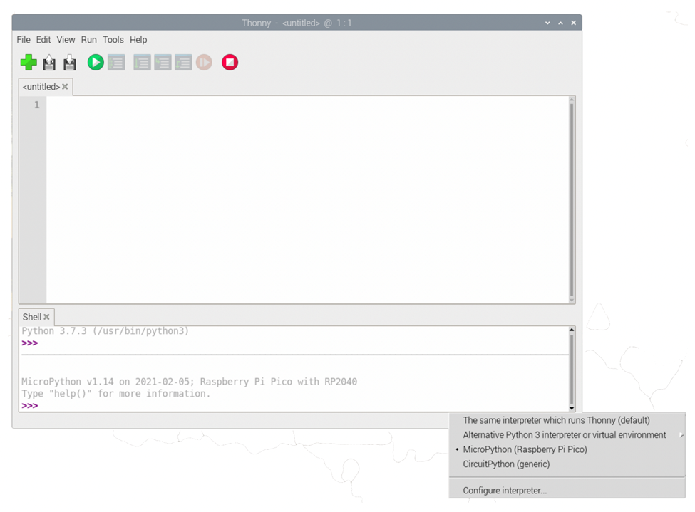

## How to Connect to Pico


#### Prerequisites:
1.	(Not Needed for Windows) Install homebrew on your computer, or make sure it is installed.
    1. 	See “Install Homebrew” section on this page: https://brew.sh/ 
    2.	Newer Mac computers may need to run these two commands after installing homebrew:
    ```
    echo 'eval "\$(/opt/homebrew/bin/brew shellenv)"' >> ~/.zprofile
    eval "$(/opt/homebrew/bin/brew shellenv)"
    ```
2.	Install MicroPython on the pico (if someone hasn’t installed it on there before)
a.	Hold the button on the Pico while plug it into your computer.
b. Release the button after plugging.
c. Drag the "open_pico.uf2" file into the Pico window.
d. It automatically closes, and that means it works!

#### Steps to run your own programs
1.	Install Thonny
2.	Switch to MicroPython interpreter by clicking in the bottom right and selecting “MicroPython”

3. Read references (https://docs.micropython.org/en/latest/rp2/quickref.html)
4. Start your own program!

---

Misc. Tips
-	You can install micropython repeatedly without damaging the pico (i.e. it’s safe to drop the uf2 file more than once if you aren’t sure it worked)
